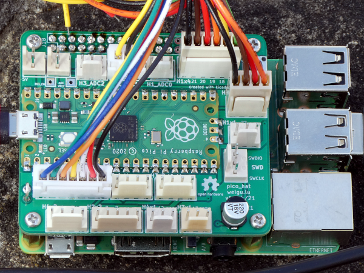

# Pico-HAT: Connect your Raspi with the Pico through I²C

## Some infos

The Pico connects to all the sensors and actuators and can act in `Real Time`. The Raspi can do the rest (Wifi, Webserver, MQTT, Display ...). The Pico is an I²C slave to the Raspi and the Raspi sends commands with a Python script to the Pico. An Arduino program on the Pico answers with sensor data or by switching an actuator.

As the Arduino IDE runs on a Raspi, both device (Raspi and Pico) can be reprogrammed via VNC from any computer, and I find this pretty amazing :).

### Features

+ The Raspi is connected through I²C with the Pico. Serial is prepared if needed (by adding 2 0&#8239;Ω resistors).
 
+ The Pico can be powered over USB (recommended if you want to reprogram it via Arduino IDE and VNC) or through the Raspi (5&#8239;V).
 
+ All GPIOs have the possibility to add a voltage divider to reduce the input voltage (e.g. 5&#8239;V to 3.3&#8239;V), or to add an external pull-down resistor.
 
+ All headers have beneath a ground pin, one or two power pins (3.3&#8239;V or 5&#8239;V; `H2` headers: 3.3&#8239;V and 5&#8239;V).

+ Additionally we get a RESET-button, an `SWD` header, 2 power header (3.3&#8239;V and 5&#8239;V), 2 Ground pins, an an 3V3_EN and ADC\_VREF pins.

### Circuit

The circuit is designed with KiCAD and is open hardware. The following headers are available:

| Name | Pin 1 | Pin 2 | Pin 3 | Pin 5 | Pin 5 | Pin 6 | Pin 7 |
|--|--|--|--|--|--|--|--|
| `5V_Pico` | GND | 5&#8239;V |
| `3V3_Pico` | GND | 3.3&#8239;V |
| `SWD` | SWDIO | GND | SWCLK |
| `H1_ADC0` | GND | ADC0 (GPIO26) | 3.3&#8239;V |
| `H2_ADC1` | GND | ADC1 (GPIO27) | 3.3&#8239;V |
| `H3_ADC2` | GND | ADC2 (GPIO28) | 3.3&#8239;V |
| `H1x1` | GND | GPIO22 | 3.3&#8239;V (or 5&#8239;V) |
| `H3x1` | GND | GPIO13 | 3.3&#8239;V (or 5&#8239;V) |
| `H4x1` | GND | GPIO12 | 3.3&#8239;V (or 5&#8239;V) |
| `H2x1` | GND | GPIO12 | 3.3&#8239;V | 5&#8239;V |
| `H1x2` &#8239; | GND &#8239; | GPIO17 (alt. RX0-TX_Raspi) | GPIO16 (alt. TX0-RX_Raspi) | 3.3&#8239;V (or 5&#8239;V) &#8239; |
| `H3x2` | GND | GPIO10 | GPIO11 | 3.3&#8239;V (or 5&#8239;V) |
| `H4x2` | GND | GPIO6 | GPIO7 | 3.3&#8239;V (or 5&#8239;V) |
| `H2x2` | GND | GPIO8 | GPIO9 | 3.3&#8239;V | 5&#8239;V |
| `H1x4` | GND | GPIO21 | GPIO20 | GPIO19 | GPIO18 | 3.3&#8239;V (or 5&#8239;V) |
| `H2x4` | GND | GPIO2 | GPIO3 | GPIO4 | GPIO5 | 3.3&#8239;V | 5&#8239;V |

## Much more infos on:

weigu.lu/microcontroller/pico_hat/index.html 
